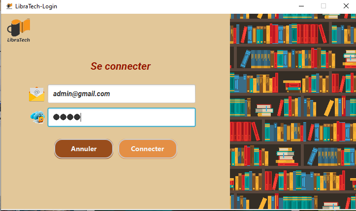

# LibraTech: Gestion de Bibliothèque avec java, JavaFX et mysql 

## À Propos de LibraTech: Description
LibraTech, notre application de gestion de bibliothèque développée en utilisant le framework JavaFX et MySQL, offre une variété de fonctionnalités conviviales grâce à ses interfaces intuitives. Découvrer comment chaque interface contribue à simplifier la gestion de votre bibliothèque. L'application inclut une base de données pour gérer les lecteurs, les livres, et d'autres éventuelles tables nécessaires.

## Fonctionnalités Principales

### Acceuil
L'interface d'accueil offre la possibilité de voir le logo de l'application ainsi qu'une description de celle-ci.

---
---

### Login
La page de connexion fournit une interface sécurisée où les utilisateurs peuvent saisir leurs informations d'identification pour accéder à l'application.

---
---

### Dashboard
Vous pouvez accéder rapidement aux statistiques. L'interface Dashboard fournit une vue d'ensemble de l'état actuel de votre bibliothèque.

---
---

### Lecteurs
Ajoutez, supprimez et recherchez des lecteurs. L'interface Lecteurs vous permet de visualiser et de mettre à jour les détails de chaque lecteur.

---
---

### Livres
L'interface vous permet d'ajouter de nouveaux livres, de les supprimer et de les rechercher.

### Emprunt de Livres
Facilitez le processus d'emprunt avec l'interface Emprunt de Livres. Suivez les transactions d'emprunt, identifiez les livres disponibles.

### Retour de Livres
Simplifie le processus de retour. Identifiez les livres retournés et mettez à jour automatiquement l'état de disponibilité.

### Employés
Ajoutez de nouveaux employés, modifiez leurs détails et assurez-vous que l'équipe fonctionne de manière optimale.

### Étagère
Optimisez le stockage des livres. Visualisez la disposition des livres dans les étagères.

### À Propos
La page "À Propos" offre un aperçu détaillé de l'application LibraTech, soulignant ses fonctionnalités clés et son engagement envers une gestion de bibliothèque simplifiée.

### Logout
La fonction de déconnexion permet aux utilisateurs de se déconnecter en toute sécurité de leur session, assurant ainsi la protection de leurs données et de leur confidentialité.

LibraTech s'engage à fournir une solution complète pour la gestion de bibliothèques. Simplifiez vos opérations quotidiennes et offrez une meilleure expérience à vos utilisateurs.

**LibraTech - Simplifiez la Gestion de Votre Bibliothèque avec Efficacité!**